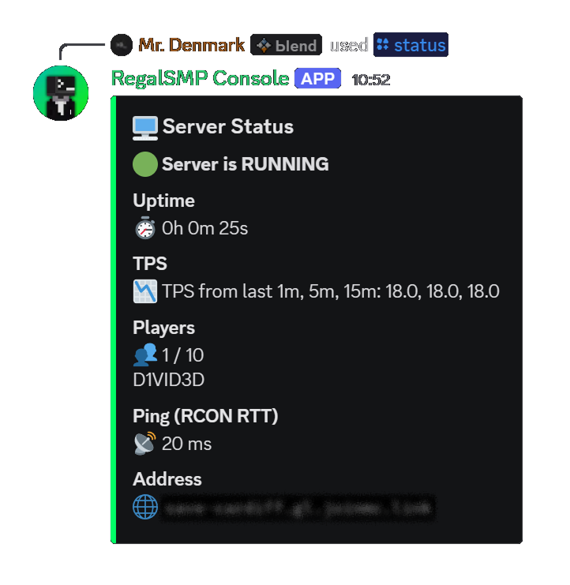
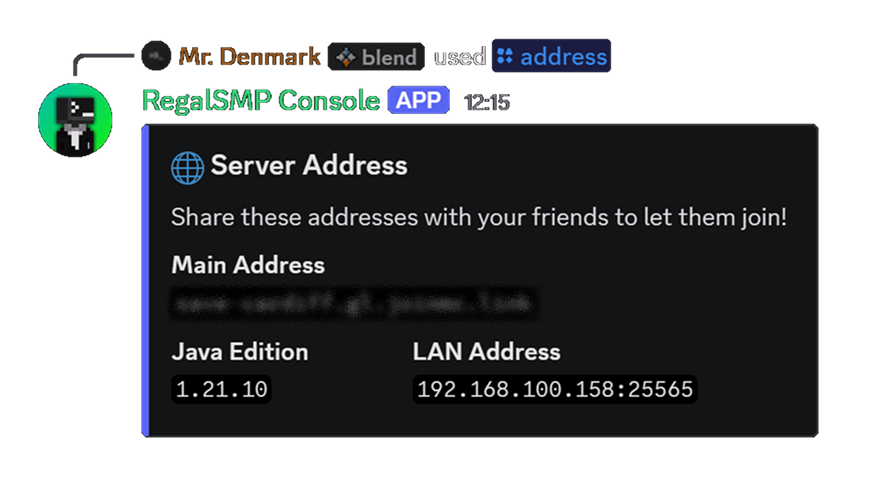
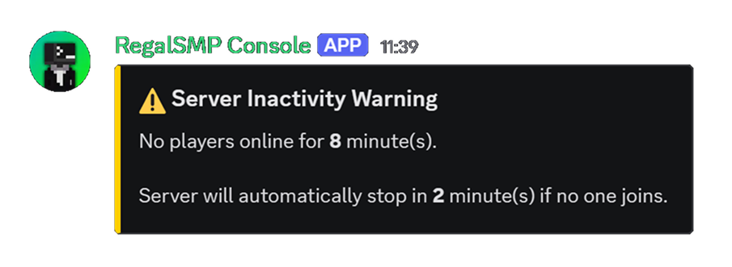
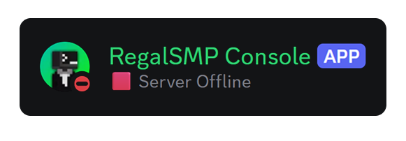

<div align="center">

  <picture>
    <source srcset="assets/logo/logo-dark.svg" media="(prefers-color-scheme: dark)">
    <source srcset="assets/logo/logo-light.svg" media="(prefers-color-scheme: light)">
    
  </picture>

  <h4>
    CraftDaemon is a lightweight Discord-native control panel for self-hosted Minecraft servers<br>
    built around systemd, RCON, and Linux-native workflows, without requiring a web dashboard.
  </h4>

  <a href="https://nodejs.org" target="_blank"></a>&nbsp;
  <a href="https://discord.js.org" target="_blank"></a>&nbsp;
  <a href="https://systemd.io" target="_blank"></a>&nbsp;
  <a href="https://papermc.io" target="_blank"></a>&nbsp;
  <a href="https://github.com/d1vid3d/CraftDaemon" target="_blank"></a>&nbsp;
  <a href="https://github.com/d1vid3d/CraftDaemon/releases" target="_blank"></a>

</div>

## Overview

CraftDaemon gives you Discord slash commands to start, stop, restart, monitor, execute console commands, and stream live logs, all from Discord. Instead of SSH-ing in or keeping a terminal open, you interact with the server entirely from Discord.

It works by sitting alongside your Minecraft server on the same host, both running as **systemd services**. The bot controls the server by calling `systemctl` commands, and reads live stats (TPS, player list, RCON latency) by talking directly to the server over **RCON**.

### How it works, at a glance

```
Discord User
     │
     │  slash command (/start, /stop, /status, /exec, /logs…)
     ▼
CraftDaemon Bot  ──── systemctl start/stop/restart ────▶  Minecraft systemd service
  (systemd)      ◀─── RCON (127.0.0.1:25575) ──────────  (Minecraft Server)
```

Two systemd services run on your host:

| Service | What it is |
|---|---|
| `craftdaemon` (or your chosen name) | The Discord bot itself |
| `minecraft` (or your chosen name) | Your Minecraft server |

The bot does **not** spawn the Minecraft process itself — it delegates entirely to systemd. This means clean startup/shutdown handling, proper logging via `journald`, and automatic restarts on failure, all without the bot being in the middle of the process tree.

### Why Paper Recommended?

CraftDaemon uses the `tps` RCON command to read server performance. This command is provided by **Paper** — it does not exist on vanilla Minecraft servers. Paper is also the standard choice for most server setups, so it's the recommended and tested platform for this bot.

> TPS will not be available in `/status` if you use other non-Paper server that doesn't support `tps`.

### Full Documentation

The full documentation is available at:  
👉 [CraftDaemon Website](https://craftdaemon.arcver.xyz/) On the Docs page.

Detailed guides, configuration options, and advanced usage are covered.  
If you're setting up the bot beyond the basics, this is your primary reference and source of truth.

---

## Features (For full showcase checkout the Website!)

### Slash Commands

| Command | Description |
|---|---|
| `/start` | Starts the Minecraft server via `systemctl start` |
| `/stop` | Stops the server via `systemctl stop` |
| `/restart` | Restarts the server via `systemctl restart` |
| `/logs` | Streams live Minecraft server logs in real-time (`live` mode) or fetches recent lines (`tail` mode) via journalctl |
| `/exec` | Executes Minecraft server commands through RCON with safety checks, in-game announcements, and confirmation prompts |
| `/status` | Shows a full status embed: systemd state, uptime, TPS, player list, and RCON ping |
| `/address` | Shows the server's connection addresses (main address, LAN, Java version) |
| `/ping` | Checks the bot's Discord API latency |
| `/help` | Shows an interactive command reference with category pages and detailed per-command info via a dropdown menu |
| `/checkupdate` | Checks GitHub for a newer release vs `package.json` and posts an announcement embed when appropriate (see `UPDATE_*` env vars) |

### Bot Responses (Brief showcase)

📸 **Screenshot:** `/status` embed - online state with RCON stats
<p align="left">
  <picture>
    <source srcset="assets/readme-assets/status-example-dark.png" media="(prefers-color-scheme: dark)">
    <source srcset="assets/readme-assets/status-example-light.png" media="(prefers-color-scheme: light)">
    
  </picture>
</p>

📸 **Screenshot:** `/exec` response embed - The response embed shows the executor, the command ran, the result, and a timestamp.
<p align="left">
  <picture>
    <source srcset="assets/readme-assets/exec-example-dark.png" media="(prefers-color-scheme: dark)">
    <source srcset="assets/readme-assets/exec-example-light.png" media="(prefers-color-scheme: light)">
    
  </picture>
</p>

📸 **Screenshot:** `/address` embed - assigned address informations
<p align="left">
  <picture>
    <source srcset="assets/readme-assets/address-example-dark.png" media="(prefers-color-scheme: dark)">
    <source srcset="assets/readme-assets/address-example-light.png" media="(prefers-color-scheme: light)">
    
  </picture>
</p>

📸 **Screenshot:** `Auto-Shutdown Warning` embed - notification posted after the set amount of time
<p align="left">
  <picture>
    <source srcset="assets/readme-assets/warning-example-dark.png" media="(prefers-color-scheme: dark)">
    <source srcset="assets/readme-assets/warning-example-light.png" media="(prefers-color-scheme: light)">
    
  </picture>
</p>

📸 **Screenshot:** `Bot Presence Status` you can see the current server status from the server member list or the bot profile's
<p align="left">
  <picture>
    <source srcset="assets/readme-assets/bot-presence-example-dark.png" media="(prefers-color-scheme: dark)">
    <source srcset="assets/readme-assets/bot-presence-example-light.png" media="(prefers-color-scheme: light)">
    
  </picture>
</p>


The `/status` command is the most information-dense response in the bot. When the server is fully online and RCON is responding, it shows systemd uptime, live TPS, current player count and names, and RCON round-trip latency — all in a single Discord embed. When the server is offline or still starting up, it reflects that state instead.

### Smart Bot Presence

The bot's Discord status is event-driven from the persistent RCON manager, with a systemd fallback while RCON is unavailable:

| State | Bot status | Activity shown |
|---|---|---|
| Server offline | 🔴 Do Not Disturb | `🟥 Server Offline` |
| Server starting (RCON not ready) | 🟡 Idle | `🟡 Server Starting...` |
| Server online | 🟢 Online | `🟩 N player(s) online` |

### Auto-Shutdown

When the server has been empty for a configurable amount of time (default: **10 minutes**), CraftDaemon automatically stops it to save resources. Before that, at the **8-minute** mark, it posts a warning to your configured status channel. Both thresholds and the check interval are fully configurable in your `config/.env`.

This is handled through the persistent RCON keepalive/player stream — no server mods needed.

### Live Logs (`/logs`)

Authorized users can stream live Minecraft server logs directly in Discord. The command has three subcommands:

| Subcommand | Behavior |
|---|---|
| `/logs live` | Streams new log lines in real-time, editing a Discord message every 2 seconds for up to your desired time |
| `/logs tail [lines]` | Fetches the last N lines as a one-time static snapshot, no live updates |
| `/logs stop` | Stops the active live log session in the current channel |

Logs are sourced from `journalctl` by default (using `MC_SERVICE` as the systemd unit), with a `file` fallback for users not running the server as a systemd service. A rotating buffer (default: 25 lines) keeps content within Discord's 2000-character embed limit, and a debounced 2-second edit interval stays well within Discord's rate limits.

Only one active live session per channel is allowed. Sessions auto-stop after 60 seconds, cleaning up the child process and session state.

### Remote Command Execution (`/exec`)

The `/exec` command lets authorized users send Minecraft server commands through RCON directly from Discord. It's built as a full administration tool with safety layers:

- **RCON execution** - commands are sent through the existing persistent RCON connection
- **Tellraw injection** - optionally announces executed commands in-game so players see who did what
- **Safety lists** - `dangerousCommands` require a confirmation prompt; `blockedCommands` are completely prevented regardless of role
- **Silent mode** - Admin/Owner-only flag to suppress in-game announcements for sensitive commands
- **Walking command autocomplete** - a tree-driven autocomplete system that suggests base Minecraft commands and walks through argument slots (players, selectors, items, literals, numbers, free-text), with RBAC filtering applied at the base-command level
- **Execution logging (Accountability)** - every command is appended as JSONL to a configurable log file (`./logs/exec.jsonl`)

---

## Before You Start

CraftDaemon is a self-hosted project with no guided installer or dashboard. Setting it up correctly requires working across a few different areas at once. You'll have a much smoother experience if you're already comfortable with:

- **Linux & systemd** - creating and managing service units, reading logs with `journalctl`, and understanding file permissions
- **Node.js** - running scripts, installing packages with `npm`, and reading basic JavaScript
- **Discord bots** - creating an application in the Developer Portal, generating a bot token, and understanding OAuth2 scopes
- **Networking basics** - what RCON is, local vs. public addresses, and basic port concepts

This isn't meant to gatekeep, the documentation tries to be as clear as possible. But if any of the above is unfamiliar territory, it's worth getting comfortable with those fundamentals first, as most setup issues stem from one of these areas rather than the bot itself.

---

## Requirements

- A **Linux machine** running **systemd** (Ubuntu, Debian, Arch, etc.)
- **Node.js 18+** (v22 recommended; used for development and testing)
- A **Minecraft server** (Paper recommended) configured as a **systemd service**, with RCON enabled
- A **Discord bot token** from the [Discord Developer Portal](https://discord.com/developers/applications)
- `sudo` access for the bot's user to run specific `systemctl` commands (see setup)

> Operating System Compatibility Note: This bot does not run natively on Windows or macOS. Advanced users may still run it using environments like <strong>Windows Subsystem for Linux (WSL)</strong> on Windows, or other Unix-like setups on macOS, but this is not officially supported.

> Node Version Note: A future migration to <strong>TypeScript</strong> is planned, which will likely require Node.js v22+.

---

## Setup

### 1. Clone the repository

```bash
git clone https://github.com/d1vid3d/CraftDaemon
cd CraftDaemon
```

### 2. Install dependencies

```bash
npm install
```

This will install all required packages, including:

- [`discord.js`](https://discord.js.org/) v14 - Discord bot framework
- [`rcon`](https://www.npmjs.com/package/rcon) - RCON client for communicating with the Minecraft server
- [`dotenv`](https://www.npmjs.com/package/dotenv) - Environment Variables loading
- [`semver`](https://github.com/npm/node-semver) - Semantic Versioning for GitHub releases comparison

### 3. Create your Discord bot application

<details>
<summary><b>Click to expand - Discord Developer Portal walkthrough</b></summary>

#### 3a. Create the application

1. Go to the [Discord Developer Portal](https://discord.com/developers/applications) and log in
2. Click **New Application** in the top right
3. Give it a name (e.g. `CraftDaemon`) and click **Create**

#### 3b. Create the bot and get your token

1. In the left sidebar, click **Bot**
2. Click **Add Bot** → **Yes, do it!**
3. Under the bot's username, click **Reset Token** and copy it — this is your `TOKEN` value
   > ⚠️ Treat this token like a password. Never share it or commit it to version control. If it leaks, reset it immediately from this page.
4. Scroll down to **Privileged Gateway Intents** and enable:
   - **Server Members Intent**
   - **Message Content Intent**

#### 3c. Get your Client ID

1. In the left sidebar, click **OAuth2 → General**
2. Copy the **Client ID** — this is your `CLIENT_ID` value

#### 3d. Invite the bot to your server

1. In the left sidebar, click **OAuth2 → URL Generator**
2. Under **Scopes**, check: `bot` and `applications.commands`
3. Under **Bot Permissions**, check: `Send Messages`, `Embed Links`, `Read Message History`
4. Copy the generated URL at the bottom and open it in your browser
5. Select your server from the dropdown and click **Authorize**

#### 3e. Get your Guild ID (Server ID)

1. Open Discord and go to **Settings → Advanced**
2. Enable **Developer Mode**
3. Close settings, then right-click your server icon in the left sidebar
4. Click **Copy Server ID** — this is your `GUILD_ID` value

#### 3f. Get your Status Channel ID

1. Right-click the channel you want the bot to post auto-shutdown warnings in
2. Click **Copy Channel ID** — this is your `STATUS_CHANNEL_ID` value

</details>

### 4. Configure your environment

<details>
<summary><b>Click to expand - Configuration setup and references</b></summary>

<br>

Your `config/.env` file is how you configure CraftDaemon. It's a plain text file that lives in the `config/` folder and is loaded automatically by the bot on startup via `dotenv`. It's never committed to version control — it stays on your machine only.


Copy the example file and fill it in:

```bash
cp config/.env.example config/.env
nano config/.env
```

## Environment Variables Reference

Your environment file is **`config/.env`** (same path the bot and `register-commands.js` load via `dotenv`). Never commit it to version control — it contains credentials.

| Variable | Required | Description | Suggested Range |
|---|---|---|---|
| **Discord Configuration** | | | |
| `TOKEN` | ✅ | Your Discord bot token (from step 3b) | — |
| `CLIENT_ID` | ✅ | Your bot's application/client ID (from step 3c) | — |
| `GUILD_ID` | ✅ | Your Discord server ID (from step 3e) | — |
| `STATUS_CHANNEL_ID` | ✅ | Channel ID where auto-shutdown warnings are posted (from step 3f) | — |
| **Minecraft & systemd Configuration** | | | |
| `MC_SERVICE` | ✅ | Your Minecraft server's systemd service name (e.g. `minecraft`) | — |
| `SERVER_TYPE` | ☑️ | Server Type (for TPS reporting in /status) | `PAPER` (default left blank), change to PAPER for Paper tps parsing |
| **RCON Connection** | | | |
| `RCON_HOST` | ✅ | RCON host IP address (default: `127.0.0.1` if bot and server are on the same machine) | — |
| `RCON_PORT` | ✅ | RCON port (default: `25575`) | `1–65535` |
| `RCON_PASSWORD` | ✅ | RCON password from your `server.properties` — must match exactly | — |
| **Auto-Stop Behavior** | | | |
| `AUTO_STOP_MINUTES` | ✅ | Minutes of inactivity before the server auto-stops (default: `10`, set to `0` to disable) | `0` or `5–60` |
| `WARNING_MINUTES` | ✅ | Minutes of inactivity before warning message is posted (default: `8`, **must be lower than `AUTO_STOP_MINUTES`**) | Below `AUTO_STOP_MINUTES` |
| `CHECK_INTERVAL_MS` | ✅ | How often (in milliseconds) to check for idle timeout (default: `30000` = 30 seconds) | `10000–60000` |
| `SAVEALL_DELAY_MS` | ✅ | Delay (in milliseconds) between `save-all` command and stop/restart to allow world data to flush (default: `1000`) | `500–3000` |
| **Command Behavior** | | | |
| `COMMAND_COOLDOWN_MS` | ✅ | Cooldown timeout (in milliseconds) between accepting start/stop/restart commands to prevent spam (default: `10000`, set to `0` to disable) | `2000–60000` |
| **Live Logs Configuration** | | | |
| `LOGS_SOURCE` | ✅ | Log source for `/logs` command (`journalctl` or `file`, default: `journalctl`) | `journalctl` or `file` |
| `LOG_FILE_PATH` | ☑️ | Path to log file, only used if `LOGS_SOURCE=file` (default: `./logs/latest.log`) | — |
| **Remote Command Execution** | | | |
| `EXEC_TELLRAW_ENABLED` | ✅ | Enable in-game announcements for `/exec` commands (default: `true`) | `true` or `false` |
| `EXEC_TELLRAW_TARGET` | ✅ | Minecraft target selector for tellraw announcements (default: `@a`) | — |
| `EXEC_TELLRAW_COLOR` | ✅ | Minecraft color name for the announcement prefix (default: `light_purple`) | Minecraft color name convention |
| `EXEC_TELLRAW_PREFIX` | ✅ | Prefix shown in-game before the announcement text (default: `[DISCORD]`) | — |
| `EXEC_SILENT_COMMANDS` | ☑️ | Comma-separated base commands that never produce a tellraw announcement (default: `login,register`) | — |
| `EXEC_LOG_PATH` | ✅ | Path for the JSONL execution log, appended on each `/exec` (default: `./logs/exec.jsonl`) | — |
| **RCON Manager Tuning** | | | |
| `RCON_KEEPALIVE_INTERVAL_MS` | ✅ | Interval (in milliseconds) for persistent RCON keepalive heartbeat (default: `45000`) | `30000–60000` |
| `RCON_RECONNECT_INTERVAL_MS` | ✅ | Delay (in milliseconds) between reconnect attempts when RCON is down (default: `5000`) | `3000–10000` |
| `RCON_STARTING_GRACE_PERIOD_MS` | ✅ | Duration (in milliseconds) to keep "Server Starting..." status after reconnect (default: `10000`) | `5000–20000` |
| `RCON_COMMAND_TIMEOUT_MS` | ✅ | Timeout (in milliseconds) for individual RCON command calls (default: `8000`) | `5000–15000` |
| `RCON_MAX_KEEPALIVE_FAILURES` | ✅ | Consecutive keepalive failures before forcing reconnect (default: `2`) | `1–3` |
| `PRESENCE_SYSTEMD_FALLBACK_INTERVAL_MS` | ✅ | Interval (in milliseconds) to check systemd state while RCON is disconnected (default: `15000`) | `10000–30000` |
| `RCON_REFUSED_LOG_INTERVAL_MS` | ✅ | Cadence (in milliseconds) for repeated "connection refused" warnings; `0` = first-only mode (default: `60000`) | `0` or `30000–120000` |
| **Logging & Debugging** | | | |
| `LOG_LEVEL` | ✅ | Global logging level (default: `INFO`) | `DEBUG`, `INFO`, `WARN`, `ERROR` |
| `DEBUG_PERMS` | ✅ | Set to `"true"` to enable RBAC decision logging (default: `"false"`) | — |
| **Optional Address Display** | | | |
| `JAVA_EDITION_VERSION` | ☑️ | Java edition version string shown in `/address` (e.g. `1.21.4`) | — |
| `MAIN_ADDRESS` | ☑️ | Your public server address shown in `/address` and `/status` (e.g. a playit.gg tunnel or port-forwarded address) | — |
| `LOCAL_ADDRESS` | ☑️ | Your LAN/local network address shown in `/address` (e.g. `192.168.1.100:25565`) | — |
| **GitHub release update notifications** | | | |
| `UPDATE_NOTIFY_CHANNEL_ID` | ☑️ | Text or announcement channel ID for new-release embeds. If unset, invalid for a guild, or missing permissions, the bot falls back to the server system channel, then the first suitable text channel | — |
| `UPDATE_SERVICE_DEBUG` | ☑️ | Set to `"true"` to enable mock testing with `UPDATE_SERVICE_FORCE_LATEST` | — |
| `UPDATE_SERVICE_FORCE_LATEST` | ☑️ | Semver string (e.g. `9.9.0`) treated as GitHub “latest” when `UPDATE_SERVICE_DEBUG` is true; skips the GitHub request for version comparison | — |

**Legend:** ✅ = Required • ☑️ = Optional (shows "Not configured" if blank)

**Key notes:** `WARNING_MINUTES` must be lower than `AUTO_STOP_MINUTES`. All `_MS` suffix values are in milliseconds. `AUTO_STOP_MINUTES=0` disables auto-stop entirely. The bot targets **Node.js 18+** (`package.json` `engines`) for built-in `fetch` (GitHub update checks) and current `discord.js` releases.

<br>

## Configure permissions (`config/permission-config.js`)

RBAC (Role-Based Access Control) determines who can run which commands via `config/permission-config.js`.

#### RBAC Configuration Reference

| Structure | Description | Example |
|---|---|---|
| `owner` | Array of Discord user IDs with all permissions (no role required) | `["123456789012345678"]` |
| `roles` | Map descriptive role names to Discord role IDs | `{ ADMIN: "111111111111111111", MOD: "222222222222222222" }` |
| `commands` | Map permission strings to arrays of allowed role names | `{ "server.start": ["ADMIN", "MOD"], "server.restart": ["ADMIN"] }` |
| `users` | Map Discord user IDs to permission strings (direct overrides, takes precedence) | `{ "444444444444444444": ["server.address"] }` |

#### Permission Strings & Defaults

| Command | Permission | Default Roles |
|---|---|---|
| `/start` | `server.start` | `ADMIN`, `MOD` |
| `/stop` | `server.stop` | `ADMIN`, `MOD` |
| `/restart` | `server.restart` | `ADMIN`, `MOD` | 
| `/status` | `server.status` | `ADMIN`, `MOD` |
| `/address` | `server.address` | `ADMIN`, `MOD` |
| `/checkupdate` | `bot.checkUpdate` | `ADMIN`, `MOD` |
| `/logs` | `admin.logs` | `ADMIN`, `MOD` |
| `/exec` | `admin.exec` | `ADMIN`, `MOD` |
| `/ping` | *(none)* | Everyone |

#### Setting Up RBAC

1. Get Discord role IDs: Settings → Advanced → Developer Mode, then right-click role → Copy Role ID
2. Get user IDs: Right-click member → Copy User ID  
3. Edit `config/permission-config.js` with your IDs and test with `DEBUG_PERMS="true"` in `.env`

**Config template example (Already supplied, no need to copy this):**
```javascript
module.exports = {
  owner: ["123456789012345678"], // Replace with your Discord user ID(s) who should have owner-level access to all commands

  // List your role IDs here with descriptive keys for easier reference in command permissions
  roles: {
    ADMIN: "111111111111111111",
    MOD: "222222222222222222",
  },
  // Define command permissions by referencing the role keys above
  commands: {
    
    // Default CraftDaemon commands (adjust as desired)
    "server.start": ["ADMIN", "MOD"],
    "server.stop": ["ADMIN", "MOD"],
    "server.status": ["ADMIN", "MOD"],
    "server.address": ["ADMIN", "MOD"],
    "server.restart": ["ADMIN", "MOD"],
    "bot.checkUpdate": ["ADMIN", "MOD"],
    "admin.logs": ["ADMIN", "MOD"],
    "admin.exec": ["ADMIN", "MOD"],
  },

  // User-specific overrides (takes precedence over role-based permissions)
  // Use case: If you want to add yourself or another user as an exception to the role-based permissions without giving them a specific role
  users: {
    "444444444444444444": ["logs.delete"] // user-specific override
  },

  // Exec-specific configuration
  // Controls which Minecraft commands each role can run, plus safety lists.
  // See the Exec Config Reference section for details.
  rolePriority: ["ADMIN", "MOD"],

  exec: {
    allowlist: {
      MOD: ["say", "kick", "time", "weather", "list", "tell", "msg", "w", "me"],
      ADMIN: ["*"],
    },

    dangerousCommands: [
      "stop", "op", "deop", "whitelist off", "ban", "pardon",
      "reload", "ban-ip", "clear", "summon", "give", "tp", "kill"
    ],

    blockedCommands: [
      "stop",
      "reload",
    ],
  }
};
```

#### Exec Config Reference

The `/exec` command extends the existing RBAC with exec-specific controls inside `config/permission-config.js`:

| Structure | Description |
|---|---|
| `rolePriority` | Ordered array of role keys for exec permission resolution (checked left to right) |
| `exec.allowlist` | Maps role keys to arrays of allowed Minecraft commands. `"*"` = unrestricted (except blocked) |
| `exec.dangerousCommands` | Commands that require a confirmation button prompt before execution |
| `exec.blockedCommands` | Commands completely blocked from execution through `/exec` regardless of role |

**Safety list priority:** If a command appears in both `dangerousCommands` and `blockedCommands`, `blockedCommands` takes precedence, it cannot run at all.

</details>

### 5. Set up the Minecraft server as a systemd service (If you haven't yet)

If you haven't already, create a systemd unit for your Minecraft server. Here's a minimal example:

```ini
# /etc/systemd/system/minecraft.service

[Unit]
Description=Minecraft Server
After=network.target

[Service]
Type=simple
User=minecraft
WorkingDirectory=/home/minecraft/server
ExecStart=/usr/bin/java -Xmx8G -Xms8G -jar server.jar nogui
Restart=on-failure
RestartSec=5s

[Install]
WantedBy=multi-user.target
```

Reload and enable it:

```bash
sudo systemctl daemon-reload
sudo systemctl enable minecraft
```

The service name you use here (e.g. `minecraft`) must match `MC_SERVICE` in your `.env`.

### 6. Enable RCON on your Minecraft server

In your `server.properties`:

```properties
enable-rcon=true
rcon.port=25575
rcon.password=your_rcon_password_here
```

This password must match `RCON_PASSWORD` in your `.env`. Keep both files out of version control.

### 7. Grant the bot sudoers permissions

The bot runs `systemctl` commands with `sudo`. You need to allow this without a password prompt for the specific commands only.

```bash
sudo visudo -f /etc/sudoers.d/craftdaemon
```

Add the following (replace `botuser` with the Linux user that will run the bot):

```
botuser ALL=(ALL) NOPASSWD: /bin/systemctl start minecraft, /bin/systemctl stop minecraft, /bin/systemctl restart minecraft, /bin/systemctl show minecraft
```

> Keep this as narrow as possible - <strong>only</strong> grant the exact commands the bot needs.

### 8. Register slash commands

Run this **once** to register the slash commands to your Discord guild:

```bash
node src/register-commands.js
```

You'll need to re-run this if you add or change any commands.

### 9. Run the bot

For a quick test:

```bash
node src/index.js
```

For persistent background operation, run it as a systemd service too. Create `/etc/systemd/system/craftdaemon.service`:

```ini
[Unit]
Description=CraftDaemon Bot
After=network.target

[Service]
Type=simple
User=botuser
WorkingDirectory=/path/to/CraftDaemon
ExecStart=/usr/bin/node src/index.js
Restart=on-failure
RestartSec=10s
StandardOutput=journal
StandardError=journal

[Install]
WantedBy=multi-user.target
```

Then enable and start it:

```bash
sudo systemctl daemon-reload
sudo systemctl enable craftdaemon
sudo systemctl start craftdaemon
```

Both services are now managed by systemd and will survive reboots.

---

## Project Structure

<details>
<summary><b>Click to expand - Project Filestructure</b></summary>

<p>

```
CraftDaemon/
├── config/
│   ├── permission-config.js   # RBAC rules (owners/roles/command permissions)
│   └── .env.example           # Environment variable template
├── src/
│   ├── index.js               # Bot entry: client, RconManager, presence, auto-stop, command loader
│   ├── register-commands.js   # Guild slash registration (reads src/commands/*.js)
│   ├── commands/              # One file per slash command (data + permission + execute)
│   │   ├── ping.js
│   │   ├── start.js
│   │   ├── stop.js
│   │   ├── restart.js
│   │   ├── address.js
│   │   ├── status.js
│   │   ├── checkUpdate.js
│   │   ├── logs.js
│   │   ├── exec.js
│   │   └── help.js
│   ├── events/
│   │   └── interactionCreate.js   # Slash dispatch: RBAC middleware → command.execute() + autocomplete routing
│   ├── permissions/
│   │   ├── index.js
│   │   ├── middleware.js      # permissionMiddleware (ephemeral deny)
│   │   └── resolver.js        # hasPermission() against permission-config.js
│   ├── utils/
│   │   ├── storage.js         # JSON persistence for per-guild update-notification state
│   │   └── env.js             # Shared env parsers: getEnvInt, getEnvString, getEnvBool, getEnvFloat
│   └── services/
│       ├── autoStopService.js # Auto-Stop/Auto-Shutdown handling and logic
│       ├── updateService.js   # GitHub release polling, ETag cache, update embed delivery
│       ├── rconManager.js     # Persistent RCON connection lifecycle + command pipeline
│       ├── rconQuery.js       # Command-facing RCON helpers (wired after clientReady)
│       ├── minecraftSystemd.js # systemctl + save-all before stop/restart
│       ├── commandLock.js     # Cooldown lock for start/stop/restart
│       ├── logger.js          # Structured logging utility used across bot modules
│       ├── logsServices/      # Live log streaming for /logs command
│       │   ├── logStream.js      # Spawns journalctl/tail, manages the child process
│       │   ├── sessionManager.js # Active sessions Map, session lifecycle (start/stop/expire)
│       │   └── logBuffer.js      # Rotating buffer logic, MAX_LINES trimming
│       └── execServices/      # Remote command execution for /exec command
│           ├── executeCommand.js    # Centralized RCON execution with middleware pipeline
│           ├── commandLogger.js     # JSONL logging for every executed command
│           ├── permissions.js       # Exec-specific permission resolution against allowlist
│           ├── blacklist.js         # Dangerous + blocked command safety checks
│           ├── confirmations.js     # Confirmation button prompts with expiry
│           ├── tellrawInjector.js   # In-game announcement via tellraw
│           └── autocomplete/        # Walking command autocomplete system
│               ├── commandAutocomplete.js # Input parser, tree walker, RCON player cache, RBAC filter, Discord formatter
│               └── commandTree.js        # Static Minecraft command argument structure (single source of truth)
├── package.json
└── README.md
```

> The `src/` layout is the intended structure, but the bot isn't rigid about it — if you prefer running `index.js` from the project root that works too, as long as paths and your systemd `ExecStart` point to the right place.

> As per v1.2.0 release, the bot now uses a **persistent RCON connection manager** with keepalive, reconnect handling, and command queueing. This avoids frequent connect/disconnect churn and keeps presence/stat data more stable.

</details>

---

## Managing Your Services

<details>
<summary><b>Click to expand - Useful systemd & journalctl commands</b></summary>

<p>

Once both services are running, you'll mostly interact with them through Discord. If you are not very familiar with systemctl and systemd in general, here are the essential commands to know for when you need to manage things directly from your server.

### systemctl - controlling services

```bash
# Check the current status of a service (active state, recent logs, PID)
sudo systemctl status craftdaemon
sudo systemctl status minecraft

# Start a service
sudo systemctl start craftdaemon

# Stop a service
sudo systemctl stop craftdaemon

# Restart a service (stop then start)
sudo systemctl restart craftdaemon

# Enable a service to start automatically on boot
sudo systemctl enable craftdaemon

# Disable autostart on boot
sudo systemctl disable craftdaemon

# Reload systemd after creating or editing a .service file
sudo systemctl daemon-reload
```

### journalctl - reading logs

```bash
# View the last 50 lines of logs for the bot
journalctl -u craftdaemon -n 50 --no-pager

# Follow live logs in real time (like tail -f)
journalctl -u craftdaemon -f

# Follow live logs for the Minecraft server
journalctl -u minecraft -f

# View logs since the last boot only
journalctl -u craftdaemon -b

# View logs from a specific time window
journalctl -u craftdaemon --since "1 hour ago"
```

`journalctl -f` is your best friend when debugging — run it in a separate terminal while reproducing an issue to see exactly what the bot or server is doing in real time.

</details>

---

## Advanced Logging Capabilities and Customization

<details>
<summary><b>Click to expand - Logging</b></summary>

<p>

### The bot uses a structured logging system with category-based prefixes, timestamps, and color-coded log levels. This makes it easier to track what's happening across different components.

## Log Categories

The logger supports the following categories:

- **[Bot]** - General bot operation and lifecycle events
- **[Discord]** - Discord.js and API interactions
- **[Minecraft]** - Minecraft server-specific events
- **[RCON]** - RCON (Remote Console) communication with the Minecraft server
- **[AutoStop]** - Auto-shutdown feature activities
- **[SystemD]** - systemd service management (start, stop, restart, status)

## Log Levels

Each log entry includes a level indicator:

- **[DEBUG]** (gray) - Detailed debugging information, suppressed by default
- **[INFO]** (green) - General informational messages about normal operations
- **[WARN]** (yellow) - Warning conditions that might need attention
- **[ERROR]** (red) - Error conditions that need investigation

## Log Format

```
HH:MM:SS [Category] [Level] Message
```

Example:
```
12:35:47 [RCON] [DEBUG] Sending command: list
12:35:47 [RCON] [DEBUG] RCON response received: There are 0 of a max of 20 players online
12:36:02 [AutoStop] [WARN] Server has been empty for 8 minutes
12:36:12 [SystemD] [ERROR] Failed to start server: Permission denied
```

## Enabling Debug Logging

Use `.env`:

```env
LOG_LEVEL="DEBUG"
```

Valid values are `DEBUG`, `INFO`, `WARN`, `ERROR`.  
No code changes required.

## Color Reference

Terminal colors used in logs:

- **Cyan** - Bot category
- **Blue** - Discord category
- **Green** - INFO level
- **Red** - Minecraft category & ERROR level
- **Magenta** - RCON category
- **Yellow** - AutoStop category & WARN level
- **White** - SystemD category
- **Gray** - DEBUG level & timestamps

## Common Log Scenarios

### Server starts successfully
```
08:15:23 [SystemD] [INFO] Start command from user#1234
08:15:24 [SystemD] [INFO] Managing systemd service: minecraft
08:15:30 [Discord] [INFO] ✅ bot is online.
```

### RCON communication issue (with persistent manager)
```
10:22:45 [RCON] [DEBUG] Sending command: list
10:22:47 [RCON] [WARN] sendCommand("list") timed out after 8000ms.
10:22:48 [RCON] [WARN] Keepalive command failed (1/2): RCON command timed out after 8000ms.
```

### Auto-stop triggered
```
14:55:12 [AutoStop] [INFO] Stopping server due to inactivity.
14:55:15 [SystemD] [INFO] Server stopped successfully.
```

## Troubleshooting

If you're not seeing expected logs:

1. Check the log level - DEBUG logs are hidden by default
2. Verify the category name matches what's in the code
3. Check that the logger is being called in the right place
4. If using an IDE, ensure it's displaying colored output (check terminal settings)

## Usage in Custom Code

To add logging to your own functions:

```javascript
const { createLogger } = require("./services/logger"); // Don't forget to fill out any custom properties in logger.js if you have any.
const myLogger = createLogger('MyComponent');

// Use it:
myLogger.info("Something happened");
myLogger.error("An error occurred: " + err.message);
myLogger.debug("Detailed debug info");
myLogger.warn("This might be a problem");
``` 

## Console/Log messages showcase

Startup config messages:

``` bash
Apr 16 03:15:30 node-0 node[3040518]: 03:15:30 [Bot] [INFO] ========== BOT STARTUP CONFIGURATION ==========
Apr 16 03:15:30 node-0 node[3040518]: 03:15:30 [Bot] [INFO] CraftDaemon v1.2.1
Apr 16 03:15:30 node-0 node[3040518]: 03:15:30 [Bot] [INFO] Active Log Level: INFO
Apr 16 03:15:30 node-0 node[3040518]: 03:15:30 [Bot] [INFO] RCON Host: 127.0.0.1
Apr 16 03:15:30 node-0 node[3040518]: 03:15:30 [Bot] [INFO] RCON Port: 25575
Apr 16 03:15:30 node-0 node[3040518]: 03:15:30 [Bot] [INFO] Minecraft Service: minecraft-service.service
Apr 16 03:15:30 node-0 node[3040518]: 03:15:30 [Bot] [INFO] Auto-stop enabled: Yes (10 min idle, warning at 8 min)
Apr 16 03:15:30 node-0 node[3040518]: 03:15:30 [Bot] [INFO] Status channel ID: 1404683867265489235
Apr 16 03:15:30 node-0 node[3040518]: 03:15:30 [Bot] [INFO] Main address: my-minecraft-server.joinmc.link
Apr 16 03:15:30 node-0 node[3040518]: 03:15:30 [Bot] [INFO] =============================================
Apr 16 03:15:31 node-0 node[3040518]: 03:15:31 [Discord] [INFO] ✅ CraftDaemon is online.
Apr 16 03:15:31 node-0 node[3040518]: 03:15:31 [Discord] [INFO] Logged in as CraftDaemon#2232
Apr 16 03:15:31 node-0 node[3040518]: 03:15:31 [SystemD] [INFO] Managing systemd service: minecraft-server.service
Apr 16 03:16:29 node-0 node[3040518]: 03:16:29 [SystemD] [INFO] Start command from steve
```

Command sent from Discord user:
``` bash
Apr 16 03:16:29 node-0 node[3040518]: 03:16:29 [SystemD] [INFO] Start command from steve
```

RCON refused (throttled) log:
``` bash
Apr 18 12:32:41 node-0 node[3348127]: 12:32:41 [RCON] [WARN] RCON connection refused (server may be offline/starting). Retrying every 5s. [connect ECONNREFUSED 127.0.0.1:25575]
Apr 18 12:33:41 node-0 node[3348127]: 12:33:41 [RCON] [WARN] RCON connection refused (server may be offline/starting). Retrying every 5s. (+11 similar refusals suppressed) [connect ECONNREFUSED 127.0.0.1:25575]
```

AutoStop engaging:
``` bash
Apr 16 03:17:00 node-0 node[3040518]: 03:17:00 [AutoStop] [INFO] Server is now empty. Auto-stop timer started (10 minutes until shutdown).
Apr 16 03:25:00 node-0 node[3040518]: 03:25:00 [AutoStop] [WARN] Server empty for 8.0 minutes. Warning sent (2 min until shutdown).
Apr 16 03:27:00 node-0 node[3040518]: 03:27:00 [AutoStop] [INFO] Server empty for 10.0 minutes (threshold: 10). Initiating shutdown.
```


## Performance Notes

- Logging is lightweight and designed for production use
- DEBUG logs are completely ignored if level is INFO or higher
- Log calls have minimal performance impact


</details>

---

## Auto-Shutdown Details

<details>
<summary><b>Click to expand - Auto-Stop </b></summary>

<p>

The bot uses persistent RCON player count state and checks it on the interval defined by `CHECK_INTERVAL_MS` (or legacy `CHECK_INTERVAL`) in your `.env`. The shutdown sequence works like this:

1. Server is running, 0 players online → inactivity timer starts
2. After `WARNING_MINUTES` of being empty → warning message posted to `STATUS_CHANNEL_ID`
3. After `AUTO_STOP_MINUTES` of being empty → `systemctl stop` is called automatically
4. If a player joins at any point → timer and warning state are fully reset

Setting `AUTO_STOP_MINUTES=0` in your `.env` disables auto-shutdown entirely. `WARNING_MINUTES` must be lower than `AUTO_STOP_MINUTES`, otherwise the warning will never fire before the shutdown.

</details>

---

## RBAC (Role-Based Access Control) Explanation

<details>
<summary><b>Click to expand - RBAC Docs</b></summary>

<p>

CraftDaemon uses a **config-driven RBAC** layer for slash commands.

- Commands declare a **permission string** (example: `server.restart`)
- The bot checks a **single config file**: `config/permission-config.js`
- The middleware decides **allow/deny** (no hardcoded role checks inside commands)
- Discord's native permission system is **not** used for authorization decisions

### How RBAC Works

**1) Permission Strings**
Each slash command requires a specific permission string, which is defined in the command handler and checked against the RBAC config.

**2) Config-Driven Rules**
The entire ruleset lives in `config/permission-config.js` — no permission logic is hardcoded in the bot itself. This makes it easy to audit and customize without touching code.

**3) Hierarchy**
- **Owners** always pass (checked first)
- **User overrides** next (direct permission string grants)
- **Role-based** last (checked if user has a specific Discord role)

**4) Strict Fail**
If a permission string isn't registered in the `commands` object, it is **denied** — not granted by default.

### Requirements

For role checks to work reliably, the bot must have:
- **Gateway Intent**: `GuildMembers` enabled
- **Discord Developer Portal**: "Server Members Intent" checkbox enabled

CraftDaemon enables `GatewayIntentBits.GuildMembers` in `src/index.js` by default.

### DM Restrictions

- Permissions only work inside guilds (`interaction.inGuild()` must be true)
- Direct messages (DMs) are denied regardless of permission config

</details>

---

## Customization

<details>
<summary><b>Click to expand - Customization</b></summary>

<p>

CraftDaemon's codebase is intentionally small and readable, and most behavior is configurable via `.env`; code edits should be the exception. But if the default behavior doesn't quite fit your setup, you're 
encouraged to open `src/index.js` and adjust things directly — you don't need to be an expert, just comfortable reading 
through code and making small targeted changes.

Some common customization points:

- **Log verbosity** - set `LOG_LEVEL` in `.env` (`DEBUG`, `INFO`, `WARN`, `ERROR`).
- **Role-Based Access Control (RBAC)** - configure owners/roles/command permissions in `config/permission-config.js` (see below).
- **RCON retry/refusal logs** - tune `RCON_REFUSED_LOG_INTERVAL_MS` (`0` = first refusal only).
- **RCON command timeout** - tune `RCON_COMMAND_TIMEOUT_MS` in `.env`.
- **RCON reconnect/keepalive cadence** - tune `RCON_RECONNECT_INTERVAL_MS` and `RCON_KEEPALIVE_INTERVAL_MS`.
- **Embed styling** - all Discord embeds are plain objects inside the slash command handlers. Colors, field labels, and copy are easy to change without touching any bot logic.
- **Auto-shutdown behavior** - configurable via `.env`, but the underlying logic lives in the `setInterval` block near the bottom of `index.js` if you want to change how it actually works.

If something's broken and you suspect it might be a simple fix, take a look at the code before opening an issue — it's probably shorter than you expect.

</details>

---

## Troubleshooting

**Slash commands don't appear in Discord**
Run `node src/register-commands.js` and wait a few minutes. Make sure your bot invite URL includes the `applications.commands` scope, and that `CLIENT_ID` and `GUILD_ID` in `config/.env` are correct.

**`sudo: a terminal is required` or permission denied on systemctl**
The sudoers rule isn't set up correctly, is configured for the wrong user, or the service name in the sudoers file doesn't match `MC_SERVICE`. Re-check step 8.

**`/status` shows RCON not responding right after `/start`**
This is expected — Minecraft servers takes time to boot and open RCON. During this window, bot presence should show `Server Starting...` and RCON logs may show refused retries.

**TPS not showing in `/status`**
TPS is read via the `tps` command which only exists on Paper. Other servers that does not support `tps` will show (Not Set) here.

**`RCON_PASSWORD is not set` error**
Your `config/.env` file is missing or not being loaded. Make sure it exists next to `config/.env.example` and that `dotenv` is installed (`npm install`).

**Auto-shutdown isn't triggering**
Check that `AUTO_STOP_MINUTES` is not set to `0` in your `.env`, and that `WARNING_MINUTES` is set lower than `AUTO_STOP_MINUTES`.

**Bot goes offline or crashes unexpectedly**
Check logs with `journalctl -u craftdaemon -n 50 --no-pager`. The most common causes are an invalid or expired token, a missing `.env` value, or a Node.js version mismatch.

---

## Like this project?

If CraftDaemon has been useful to you, consider giving it a ⭐ on GitHub! It helps others discover the project and means a lot to the development. Thanks for using it.

---

## Contributing

This is a personal-use project. PRs and issues are welcome — open an issue first for larger changes so we can align before you put work in.

---

## License

MIT — see [LICENSE](LICENSE).
